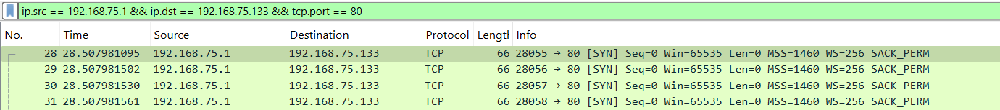
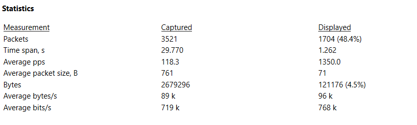
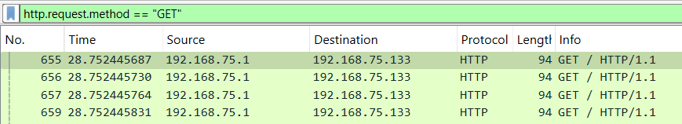
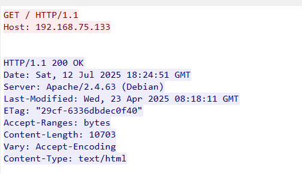
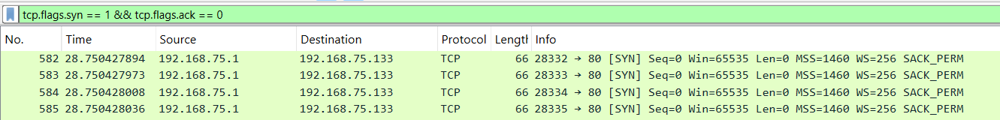
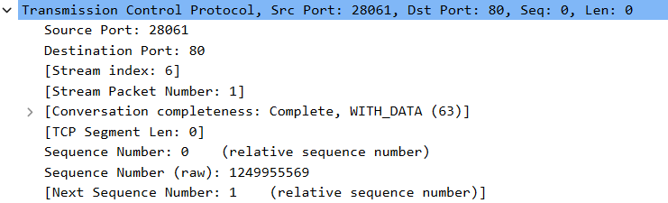
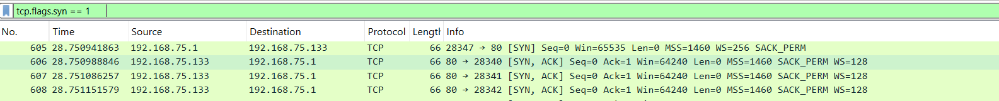
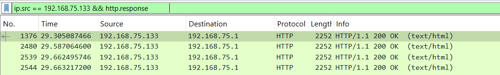
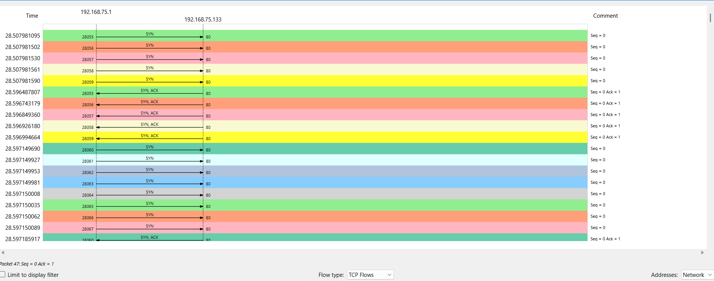

# Analysis of the HTTP GET Flood attack 1

target IP  – 192.168.75.133  
Target port – 80  
Total request – 300 request  
Attack layer – layer 7  
Total packets on Wireshark – 3521  

---

## Filter 1 :- ip.src == 192.168.75.1 && ip.dst == 192.168.75.133 && tcp.port == 80

Packets – 1704 (48.4%)

this filter indicates all tcp packets on port 80 between this source and destination Ip,

---

## Capture file properties –

Time Span (Displayed) – 1.262 sec  
Avg Packets/sec (pps) – 1350 packets/sec  
Avg Packet Size (B) – 71 bytes (smaller packet size)  
Avg Throughput – around 96k (basic to moderate)

(This confirms high-volume short-burst flooding behaviour targeting Apache)

---

## filter 2 :- http.request.method == "GET" 			

(300 packets – 8.5%)

(this filter indicates the true attack count of the all the GET requests)

---

## TCP stream analysis 

Opened the GET packet and analysis of the TCP stream ( right click on the any GET packet then follow and then TCP stream)

GET / HTTP /1.1  
Host: 192.168.75.133

(this Screenshot is regarding the basic GET request to the root path and show the no custom headers are seen means we can tell this is basic minimal level attack and can be machine generated also (which is true)

200 OK indicate the request was valid and processed.

---

## Filter 3 :- tcp.srcport		

(3494 packets – 99.2%)

A total of 3494 TCP packets were captured during the attack, making up approximately 99.2% of all packets in the capture file. This confirms that the attack primarily consisted of TCP traffic, as expected for an HTTP GET flood.

---

## Filter 4 :-  tcp.flags.syn == 1 && tcp.flags.ack == 0		

(300 packets – 8.5%)

(These are pure SYN packets - the start of the TCP 3-way handshake, 1 SYN per thread, this all are outbound connections attempts from windows )

---

## GET packet Frame details

Opening one of the GET packet frame here to see the important details ( open packet frame – transmission control protocol )

Sequence number – 0 (relative), raw: 1249955569  
Source Port – 28061  
Acknowledgment Number - 0 (As expected for SYN — it doesn’t ACK yet)

---

## Filter 4 :- tcp.flags.syn == 1		

(600 packets – 17%)

(This filter indicate both SYNs and SYN-ACKs: where 300 sent by the windows means attacker and 300 send by kali means victim)

---

## Filter 5 :- ip.src == 192.168.75.133 && tcp.flags.reset == 1		

(0 packets)

(this filter tells that if kali has rejected any packet or not, but here the packets shown are 0 means kali has not rejected any packet )

---

## Filter 6 :- ip.src == 192.168.75.133 && http.response		

(124 packets – 3.5%)

Although 300 GET requests were sent, only 124 responses (200 OK) were received

---

## Visual traffic analysis 

### I/o graph 

The I/O graph, plotted with 1-second intervals, reveals a sharp spike in traffic beginning at ~28 seconds. Packet rate surged from 0 to over 2.5k packets/sec, sustaining briefly during the 1.2-second attack window. This aligns with the previously measured attack duration and confirms the high-volume burst nature of the HTTP GET flood. Prior to the spike, traffic remained idle, indicating a deliberate and sudden initiation from the attacker.

---

### Flow graph (statistics – flow graph) (TCP flow selected)

The TCP Flow Graph visualization illustrates multiple independent connection attempts during the flood. Each flow follows the expected handshake sequence: SYN → SYN-ACK → ACK. The attacker generated these connections using different ephemeral source ports, confirming that each GET request was sent over a new TCP connection.

---

## Summary

The HTTP GET flood attack was executed as a short-burst, high-rate Layer 7 DoS attempt. With 300 GET requests sent in just 1.2 seconds, and only 124 successful responses received, the Apache server showed partial degradation in availability. The traffic was fully formed, with complete TCP handshakes, but minimal HTTP headers — making it easier to detect using IDS/WAF tools. No connection resets or rejections were observed from the server, suggesting it handled the burst but was under visible load.
