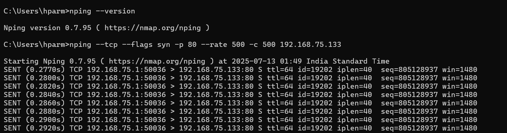
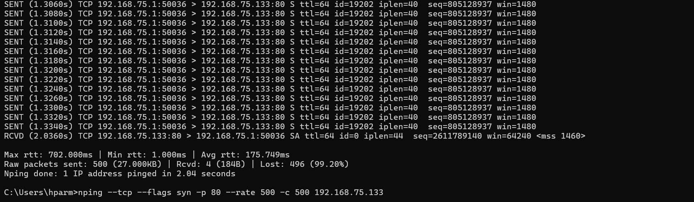
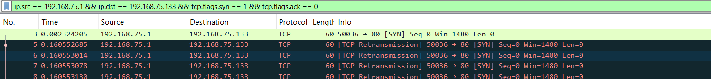
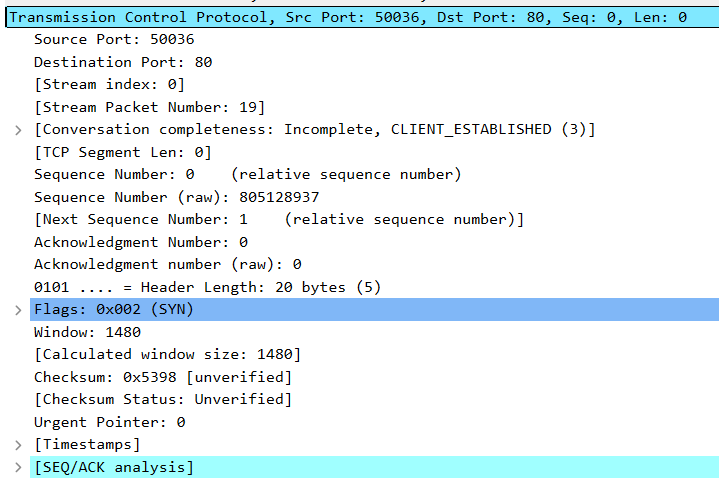
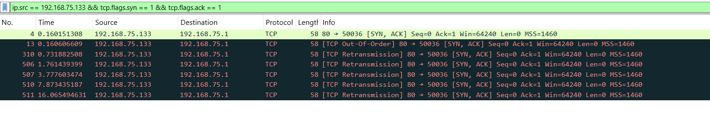
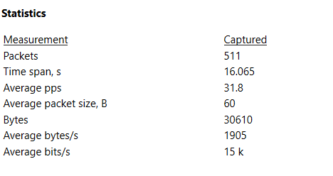
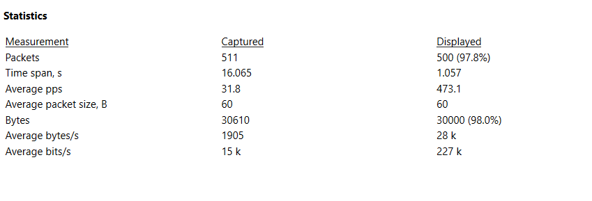
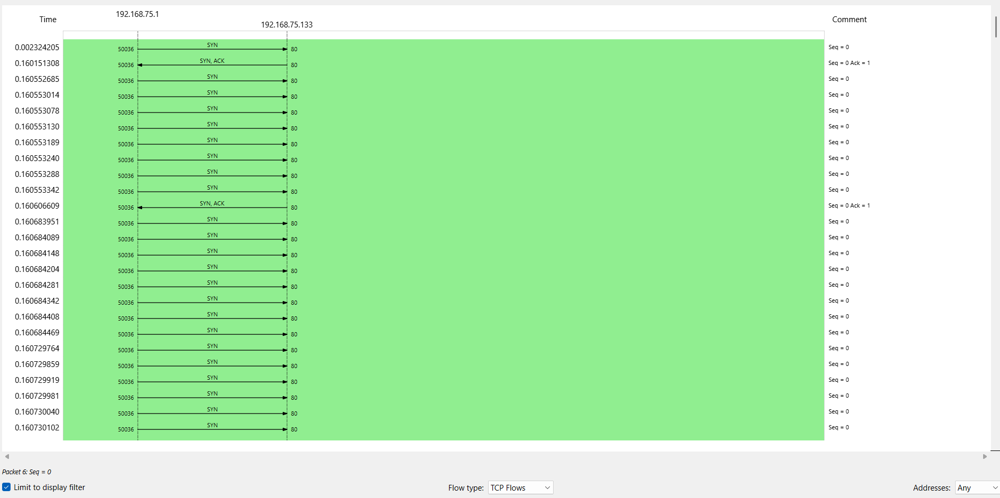

# Analysis of TCP SYN Flood Attack 2

## The cmd screenshot also provide some valuable information

### Details

Source port used :- 50036 (same for all SYNs)

All request send is :-   S (SYN flag which is 1st step of handshake)

TTL (Time-To-Live) :- 64

Iplen (Total IP packet length) - 40 (SYNs are usually small)

Min RTT (Round trip time) :- 1 ms

Max RTT (Round trip time) :- 702 ms

Avg. RTT (Round Trip Time) :- 175.749 ms

Total 500 Raw requests are during the attack and out of  4 SYN-ACKs received which means 496 are lost  - 99.2% loss )

The attack lasted approximately 2.04 seconds, during which 500 TCP SYN packets were sent at a configured rate of 500 packets per second.

---

## Wireshark traffic analysis

Wireshark Total packets captured :-   515 packets

Layer :- layer 4 attack

---

### Filter 1
`ip.src == 192.168.75.1 && ip.dst == 192.168.75.133 && tcp.flags.syn == 1 && tcp.flags.ack == 0`

Packets – 500 (97.8%)

This filter only appear pure SYN packets (the first step of TCP 3 way handshake) not the ack packets.

---

---

### TCP packet frame analysis
(select any SYN packet – transmission control protocol)

Source port – 50036  
Destination port – 80  
Sequence Number – 805128937 (raw), 0 (relative)  
Acknowledgment Number – 0  
Conversation completeness – incomplete, CLIENT_ESTABLISHED  

The inspected SYN packet confirms that the attacker used fully valid, well-formed TCP packets to initiate connections without completing the handshake. The incomplete conversation state verifies the half-open connection technique, which aims to exhaust the server’s TCP backlog and disrupt legitimate connection attempts.

---

### Filter 2
`ip.src == 192.168.75.1 && tcp.flags.ack == 1 && tcp.flags.syn == 0` (0 packet)

While applying this filter it confirms that the attacker never completed the 3-way handshake means no connections were completed and all SYNs remained half-open, consistent with the intended behaviour of a SYN flood attack the attack of the half open connection is proper)

---

### Filter 3
`ip.src == 192.168.75.133 && tcp.flags.syn == 1 && tcp.flags.ack == 1` (7 packets – 1.4%)

Only 7 SYN-ACKs were received from the server, despite 500 SYNs being sent. This indicates that the server attempted to respond but could only handle a small number of incoming connections, likely due to backlog saturation. This confirms the effectiveness of the SYN flood in exhausting server resources. This shows TCP backlog saturation or server throttling under pressure.

---

### Filter 4
`ip.src == 192.168.75.133 && tcp.flags.reset == 1` (0 packets)

It shows 0 packets means No TCP RST packets were observed from the victim server. This indicates that the server did not actively reject the incoming SYNs, likely due to backlog exhaustion or silent drop behavior under DoS conditions.

---

## Total capture file properties

Average packet size - 60 bytes (Normal for TCP SYN packet - small, no payload)  
Packets – 511  
Time span – 16.065 (the complete time Wireshark is open and capturing)

For the comparison between the actual Wireshark overall traffic and the filtered only attacked traffic the capture file properties,

Here displayed packets indicate the SYN request packets:

Time span (Displayed) - 1.057 (It shows intense tight burst equal to only 1 second for the 500 requests)  
The average PPs (Displayed) - 473.1 (It indicates the much higher 473 packets per second, where the original full captured traffic is only showing 31.8 due to higher time opening of the Wireshark)

---

## Visual traffic analysis

### I/O graph (interval – 1 sec)

The I/O graph, filtered to show only SYN packets, reveals a sharp spike of approximately 500 packets per second occurring in the first second of capture. This confirms that the attack was a short-burst, high-volume SYN flood. After the burst, traffic dropped off completely.

---

### Flow graph
(statistics – flow graph, flow type set to TCP flow)

The TCP Flow Graph illustrates multiple incomplete connection attempts where SYN packets were sent by the attacker, but no corresponding ACKs were returned. Only a few SYN-ACK responses were observed from the server.

This visualization clearly confirms the presence of numerous half-open TCP connections - a signature behaviour of SYN flood attacks.

---

## Summary

The TCP SYN flood attack successfully delivered 500 SYN packets in under 1.1 seconds, exploiting the TCP handshake mechanism by never completing connections. With only a handful of SYN-ACKs received and no ACK responses, the attack led to numerous half-open connections, effectively consuming the server’s TCP backlog resources. The flow graph confirms that most SYNs received no ACK, and the I/O graph visualizes the sharp traffic burst. No reset (RST) packets were seen from the server, indicating it could not reject or close these connections. This demonstrates a typical and effective Layer 4 DoS condition.
