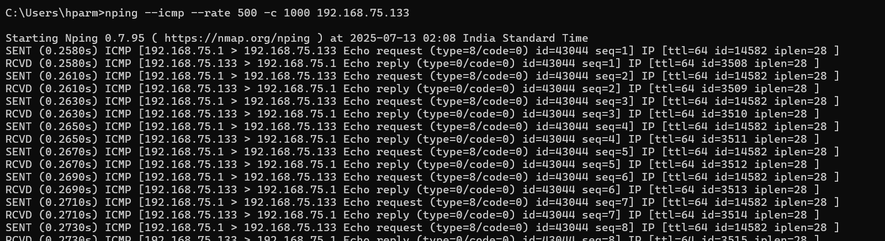
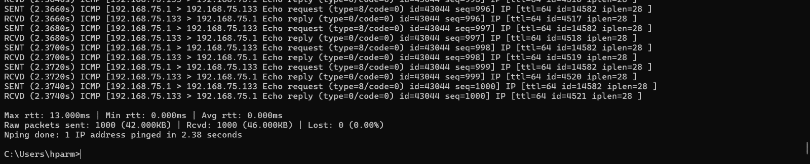
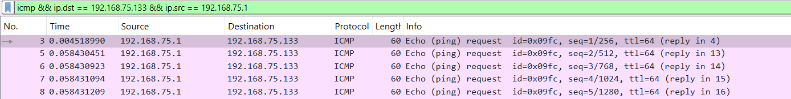
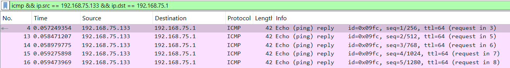
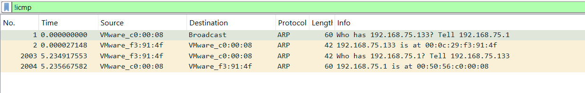
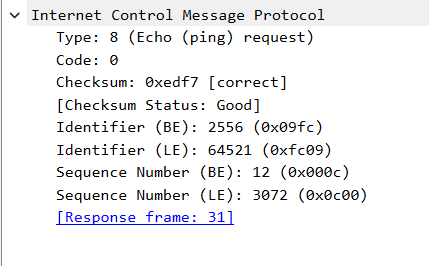
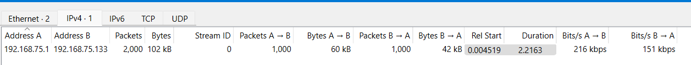
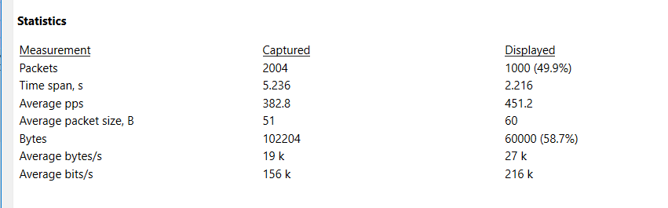

# ATTACK 3 – ICMP PING FLOOD ANALYSIS

The cmd screenshot also provide some valuable information

  

---

## Details

Packets Sents :- 1000  
Layer :- layer 3 attack  
TTL (Time-To-Live) :- 64  
Iplen (IP packet length) :- 28  
RTT (Round Trip Time) - Min: 0ms  
RTT (Round Trip Time) - Max: 13ms  
RTT (Round Trip Time) - Avg: 0ms  
Time span of attack :- 2.38 sec.

The attack succeeded in flooding 1000 ICMP Echo Requests at ~500pps. The server responded to every request (1000 replies). No packet loss, showing that the victim system could handle this specific ICMP flood load.

ICMP Ping Flood is a Layer 3 volumetric attack leveraging echo requests (ICMP type 8) to consume victim processing or bandwidth. Since ICMP is connectionless and stateless, the attack doesn't rely on TCP/UDP handshakes and can be executed at high speed with minimal resource cost on the attacker’s side

---

## Wireshark traffic analysis

Wireshark Total packets captured -   2004 packets  
Protocol - ICMP

---

## Filter 1 :- icmp && ip.dst == 192.168.75.133 && ip.src == 192.168.75.1		(1000 packets - 49.9%)

This filter Show only ICMP Echo Requests from attacker to target

---

## Filter 2 :- icmp && ip.src == 192.168.75.133 && ip.dst == 192.168.75.1		(1000 packets - 49.9%)

This filter shows only the ICMP Echo Replies from Kali to Windows - so this is also 1000 means a stable response without any loss)

---

## Filter 3 :- !icmp			(4 packets – 0.2%)

This filter indicates only the remaining packets which are not in ICMP so we can get the extra unique packets which are not part of ICMP echo request and ICMP echo reply.     

---

## Filter 4 :- icmp.type == 3		(0 packets)

0 packets indicates that there is) error happened.

---

## ICMP header analysis

(select any random ICMP echo request packet frame – internet control message protocol)

Type: 8 (ICMP Echo ping Request)  
Code: 0 (standard for echo request)  
Sequence Number (BE): 12 (0x000c)  
Identifier (BE): 2556 (0x09fc)

Echo Identifier are assigned by the sender (attacker) so here for all the ICMP echo request packets the identifier (BE) is same 2556 which confirms this is a single-process attack because all packets sent from the one sessions has same echo id.

Each packet gets a unique sequence number, starting from 0 and incrementing by 1, so here due to each linear packets frame having the linear increasing sequence number (BE) it confirms that the attack is also linear not random and jump seen during the attack.

---

## Conversations (statistics – conversations)

The conversation was symmetric, attacker sent 1000 requests, victim replied with 1000 responses. This confirms that the victim stack was not saturated enough to drop or ignore requests — a sign that the attack volume was not sufficient to exhaust buffer/queue thresholds.

---

## Capture file properties

Here the captured means the overall Wireshark traffic and the displayed means the, icmp && ip.dst == 192.168.75.133 && ip.src == 192.168.75.1 filter packets, this packets which are the actual attack traffic. 

Time Span (s)	5.236s (full captured)  
Time Span (s)	2.216s (displayed actual attack)

here it means the actual flood Laster for only around 2.2 sec and the 5.236 sec time was of the Wireshark which can be because it runs longer.

Avg. Packets/sec (PPs) - 451.2 (for the actual displayed packets)  

Actual attack rate is 451 PPs (close to expected 500).  
For the actual attack packets of the filtered where All packets were uniform in size (60 bytes), confirming low entropy, high volume

---

## I/O graph

Y-Axis: Packets per second (PPs)  
Interval: 1 second

The Wireshark I/O graph for the ICMP Ping Flood (Attack 3) demonstrates a sharp burst of traffic peaking near 950 packets per second, sustained for the first 1–1.2 seconds. The packet rate sharply declines thereafter, indicating the end of the flood at approximately 2.2 seconds.

---

## Victims behaviour under attack(load)

During the attack the Victim responded 1:1 for each request there was No loss observed at L3, Apache service remained reachable, No TCP-layer resets, DNS failures, or routing anomalies are detected. While the attack was successfully executed at 450+ PPS, the server showed no signs of degradation at this volume this confirms that server can easily handle this much load of packet traffic. 

---

## Summary

An ICMP Ping Flood DoS attack was performed by sending 1000 echo request packets from the attacker (192.168.75.1) to the target (192.168.75.133) at an intended rate of 451 packets per second. Wireshark captured total 2004 total packets, of which 1000 (49.9%) were outbound requests. The attack lasted ~2.2 seconds and achieved a filtered throughput of ~27 KB/s. All 1000 requests were successfully echoed by the server with zero loss. The attack demonstrates a clean layer 3 volumetric flood with and the. Payload analysis confirmed low entropy with static content, and header inspection revealed a single-source, unsophisticated flooding pattern, the attack's simplicity also made it highly detectable, and its impact was limited.
