# ATTACK 4 – Slowloris

The cmd screenshot also provide some valuable information

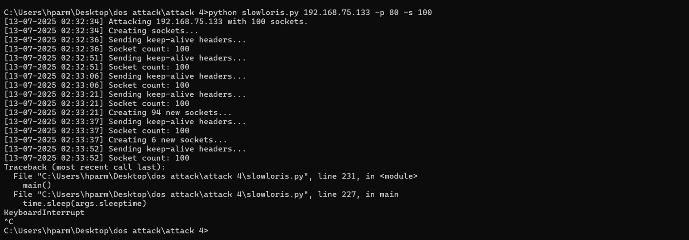

---

## Details

Total packets :- 3137  
Layer :- 7 layer  
Time span :- 78 sec.  
Socket count :- 100

Total attack lasted: from 02:32:34 to 02:33:52 ≈ 78 seconds of sustained socket holding.

The attack is run on loop till the service crash so the attack needs to manually stop by using Ctrl+C which interrupted the flow and stop it.

---

## Filter 1 :- ip.src == 192.168.75.1 && tcp.port == 80		(1511 packets - 48.2%)

These filters displayed All TCP packets from attacker (Windows) to victim (Kali’s Apache server) on port 80.

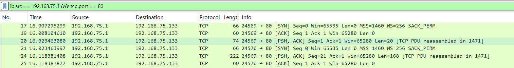

---

## Filter 2 :- tcp.flags.syn == 1 && tcp.flags.ack == 0		(200 packets – 6.4%)

This filter Shows initial SYN requests from attacker, and it identifies how many TCP connection attempts are made

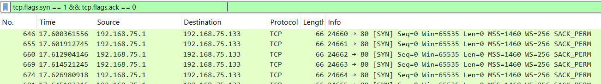

---

## Filter 3 :-= tcp.flags.syn == 1		(400 packets – 12.8%)

This Gives packet show total SYN activity, useful for identifying retry attempts, so it also includes the retransmission attempt packets.

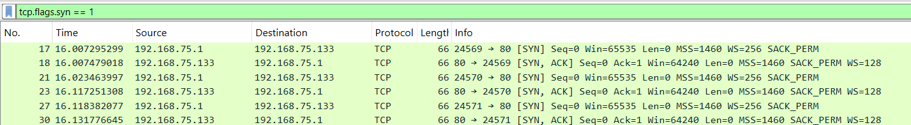

---

## Filter 4 :- ip.src == 192.168.75.133 && tcp.flags.reset == 1		(194 packets – 6.2%)

This filter displayed only RSTs from victim. It proves that server was forced to closed the socket during attack.

Apache responded with HTTP 408 Request Timeout errors across multiple TCP streams. These were observed when the attacker failed to complete the HTTP request.

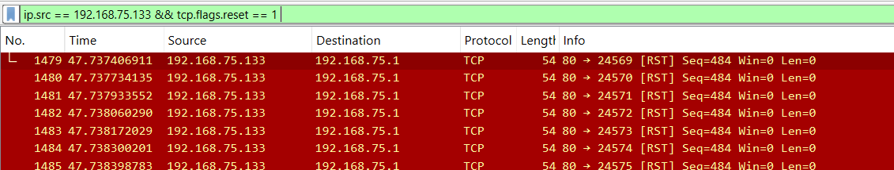

---

## Filter 5 :- tcp.flags.reset == 1		(200 packets – 6.4%) 

This filter displayed all TCP Reset packets, it helps to search for the forcefully closed connections that’s why showing the reset packets.

---

## Filter 6 :- tcp.len == 0		(1911 packets – 60.9%)

This filter displayed all packets with no payload, slowloris often used by them to keep connections alive. This helps during the attack to stabilize the connection for longer duration, here out of 3137 total packets 1911 packets are without payload which are empty packets.

---

## Filter 7 :- http.request		(0 packets)

This filter shows the full HTTP GET/POST request, and 0 packets is a confirmation of the slowloris attack because slowloris does not send any full HTTP request message.

---

## Filter 8 :- tcp.analysis.zero_window		(0 packets)

This filter shows that when the server's receive window becomes zero means the server cannot accept more data, which helps to identifies that server is overloaded and can not load more request means Dos working, but here it’s not indicating means the server is in working condition during the attack because we have not run the slowloris attack for the longer time.

---

## Analysis of TCP stream and header behavior (use filter for only TCP packets – go to follow – TCP stream)

### Packet 26

Windows sent: -  
GET /?1620 HTTP/1.1  
User-Agent: Mozilla/5.0 (Macintosh; Intel Mac OS X 10_11_6)  
Accept-language: en-US,en,q=0.5  
X-a: 1930  
X-a: 4625

The kali (victim) respond :-  
HTTP/1.1 408 Request Timeout  
Server timeout waiting for the HTTP request from the client.

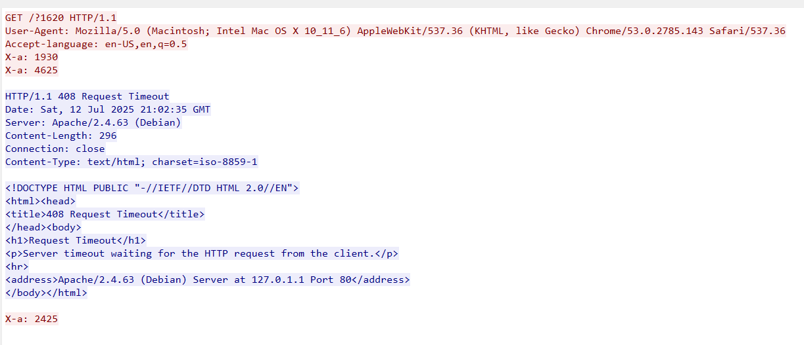

---

### Packet 52 TCP stream

Windows sent :-  
GET /?1 HTTP/1.1  
User-Agent: Mozilla/5.0 (Macintosh; Intel Mac OS X 10_11_6)  
Accept-language: en-US,en,q=0.5  
X-a: 1363  
X-a: 3287

Kali (victim) responds :-  
HTTP/1.1 408 Request Timeout  
Server timeout waiting for the HTTP request from the client.

connection showing identical behavior. Headers were sent partially — likely spaced out over time — without closing the request. Apache issued a 408 timeout after waiting too long. This proves that multiple sockets were affected, not a one-off case.

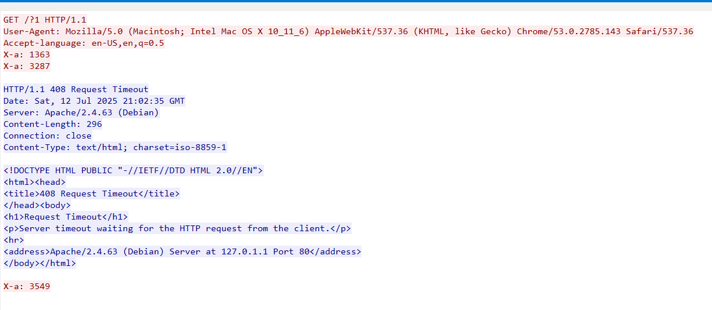

---

### Packet 668 TCP stream

Windows send :-  
GET /?1227 HTTP/1.1  
User-Agent: Mozilla/5.0 (Macintosh; Intel Mac OS X 10_11_6)  
Accept-language: en-US,en,q=0.5  
X-a: 3348  
X-a: 1963

Kali victim responds :-  
HTTP/1.1 408 Request Timeout  
Server timeout waiting for the HTTP request from the client.

Apache again responded with a timeout error after incomplete headers. The pattern matches prior streams. The X-a values varied, but structure and result remained constant — indicating a scripted, slow-paced header injection.

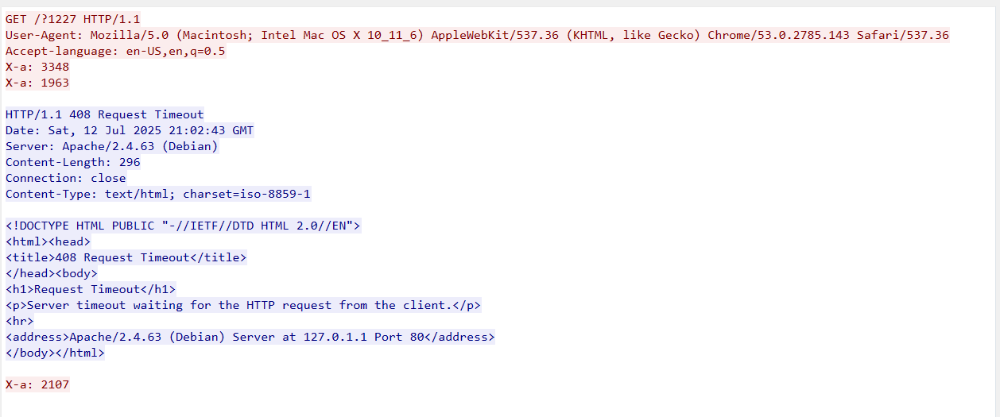

---

In all observed TCP streams (e.g., Stream 26, 52, 668), the client began partial HTTP header delivery but never completed the request, resulting in HTTP 408 Request Timeout responses. This confirms the application-layer effect of the Slowloris attack on the Apache server.

---

## Capture File Properties (for the full traffic on Wireshark)

Packets - 3137  
Time span - 95.656 sec (the complete time when Wireshark captured packets)  
Average PPs - 32.8  
Average packet size - 102 bytes  
Average bytes/s - 3330 bytes/s

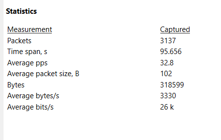

---

## Conversations (statistics – conversations)

The TCP Conversations view showed multiple simultaneous connections from the attacker (192.168.75.1) to Apache (192.168.75.133) on port 80.

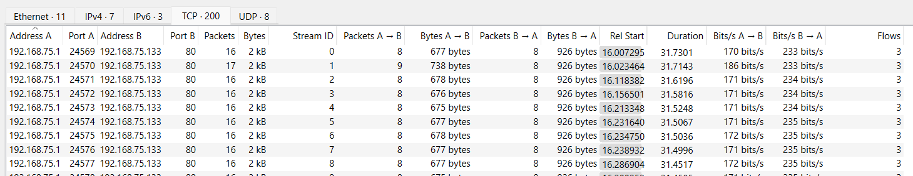

---

## Protocol hierarchy (statistics – protocol hierarchy)

Total packets: 3137  
IPv4: 96.7% (3032 packets)  
TCP: 96% of total (3011 packets)  
HTTP: only 6.4% (200 packets)  
Line-based text (likely incomplete HTTP): 6.4%  
No UDP flood: UDP is 0.4% (11 packets)

The traffic is almost entirely TCP — matching expectations for a Slowloris attack, only 6.4% recognized as HTTP suggests most requests were incomplete, confirming the goal of Slowloris, no flooding via UDP or ICMP, confirming it's a pure Layer 7 socket exhaustion attack.

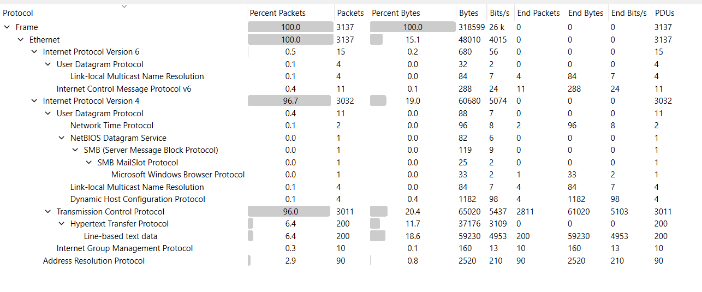

---

## Visual traffic analysis

### I/O graph (statistics – I/O graph)

Filter used :- ip.src == 192.168.75.1  
interval :- 1 sec.

Graph lines:  
All packets (red): Full traffic (attacker + server)  
slowloris PPs (black): Filtered attacker packets

This I/O graph is different than other attacks graph because here is not a single peak of packet flood initial and the suddenly stops but the different behaviour of attack which is slow in nature and indicate the unique Dos attack behaviour of the slowloris attack.

This graph suggests the multiple low spikes of the 10 to 200 PPs, which shows the attacker sending low and spaced header. then we can see 2 major spikes of the 600 PPs, which indicates burst of header injection to refresh all the sockets.

We can even notice the flat or near zero lines which indicates the slowloris behaviour of sockets are being open and not flooded with header or take the connection open for eventually time out of that.

During all the graph of the low and high spikes we can even see the those are repeating which suggest a loop in script which control this (which is true because this was controlled by the slowloris script), if we run the attack for longer time, we get more better visuals to support this point.

---

## Flow graph (statistics – flow graph, flow type selected as TCP flows)

The TCP Flow Graph shows multiple concurrent TCP connections initiated by the attacker. Each follows a complete handshake (SYN, SYN-ACK, ACK) and sends only minimal payloads — typically one or two headers (PSH, ACK – Len: 20/21). These headers were insufficient to complete a valid HTTP request, and no terminating \r\n\r\n was found.

The server did not respond with HTTP content, indicating it was waiting for more data. After prolonged idleness, many sockets were closed with either 408 Request Timeout responses or TCP RSTs.

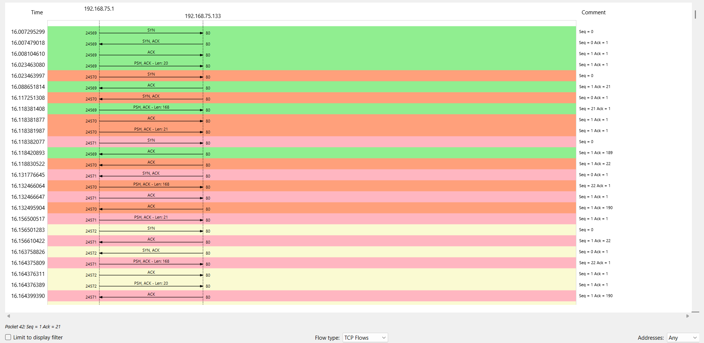

---

## Summary

The attacker exploited application-layer vulnerabilities by sending partial HTTP headers slowly to the Apache server by slowloris, keeping numerous connections open without completing any requests. Each stream included headers like X-a: b but omitted the final delimiter (\r\n\r\n), . This caused the server to hold resources unnecessarily, leading to HTTP 408 timeouts and TCP resets. The low throughput (3330 bytes/sec) and repetitive traffic (Avg. 102B packets) confirm a low-entropy, high-socket-pressure L7 DoS.
