# Attack 5 HULK HTTP unbearable load king analysis

The cmd screenshot also provide some valuable information

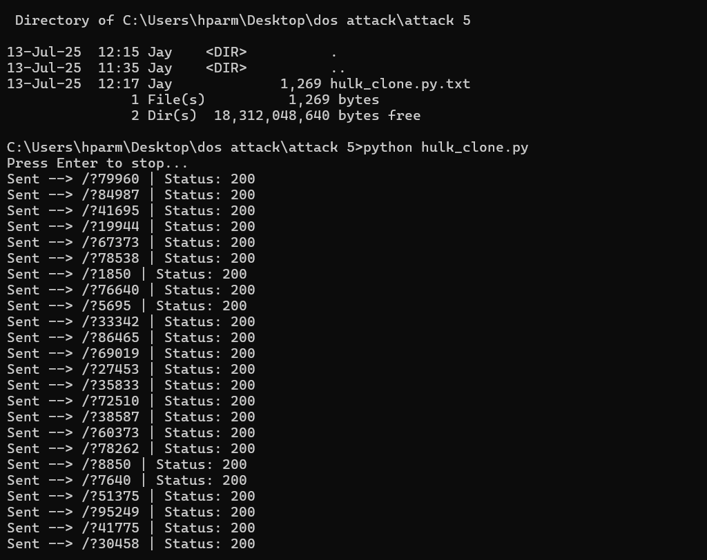

---

## Details

Total packets :- 66641 packets  
Layer :- layer 7 attack  
Timespan :- 31 sec.  
Wireshark dropped 10,646 packets = 16.0% losses

That’s not about SYNs. That’s about Wireshark's internal packet drop during capture.

The attack is run on loop till the service crash so the attack needs to manually stop by using Enter which interrupted the flow and stop it.

---

## Filter 1 :- ip.src == 192.168.75.1 && tcp.port == 80 (43137 packets – 64.7%)

These are all TCP packets sent by attacker targeting the port 80, It include: HTTP GET requests, TCP ACKs, Keep-alive, Possibly retransmissions, this tells the Large level TCP level flood.

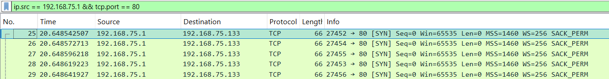

---

## Filter 2 :- http.request.method == "GET" (5566 packets - 8.4%)

Filters all packets where the HTTP method used is GET, which means the client is requesting data from the server, help to estimate the GATE flooding level.

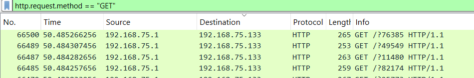

---

## Filter 3 :- tcp.flags.syn == 1 && ip.src == 192.168.75.1 (5581 packets – 8.4%)

All SYN packets (TCP connection initiations) sent by the attacker to the target. These SYNs are used by HULK to force the server into tracking half-open connections, contributing to resource exhaustion.

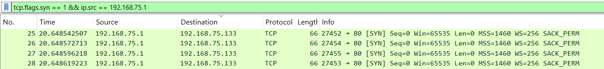

---

## Filter 4 :- tcp.flags.reset == 1 && ip.src == 192.168.75.1 (5568 packets – 8.4%)

This filter Shows only RSTs sent by attacker it is for checking that attacker HULK has drops connections fast to save memory which make server threads left hanging. This behaviour tricks the server into keeping state while the attacker moves on to flooding.

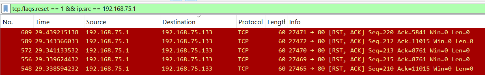

---

## Filter 5 :- ip.src == 192.168.75.133 && http.response (5464 packets – 8.2%)

This filter displayed the packets when the attacker(windows) has sent the request and for that the victim has send the response which helps during to prove that how many responses the server was able to handle and reply to.

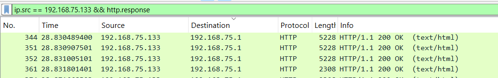

---

## Filter 6 :- tcp.flags.push == 1 && tcp.flags.ack == 1 (17798 packets – 26.7%)

This filter includes the TCP packets which was carrying data, and indicate that HULK has send the full HTTP request not the half requests like the slowloris, and this full HTTP request is the indicating point for the HULK because HULK used as an aggressive and high rated attack where the complete HTTP request is used for the overwhelming.

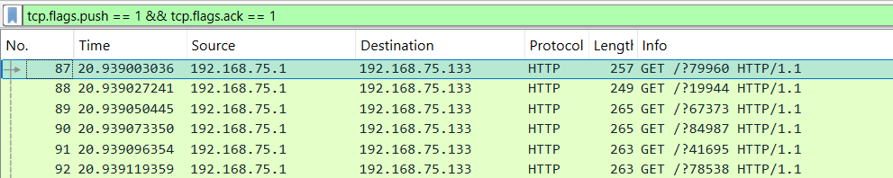

---

## Filter 7 :- http.response.code == 408 (o packets)

This filter is used to detect any timeout session from the victim, so here 0 packets mean there is no time out error where the server handled the flood within the time range and several reset packets is before filter suggest that server has choose to rest the request rather than timeout them.

---

## Filter 8 :- tcp.analysis.flags (697 packets – 1 %)

This filter displayed all the TCP-Level issues which includes the retransmission, windows full, out of order packets duplicate Acks etc which confirms the degradation of the performance. It confirms that server is struggling and there is seen congestion, instability or lag due to high load of the requests which confirms the Dos attack and it’s working.

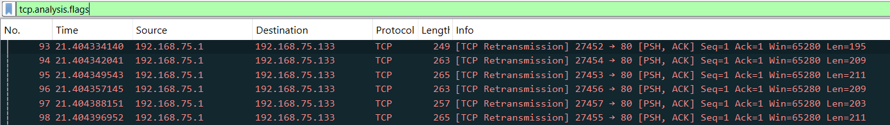

---

## Filter 9 :- frame contains "User-Agent" (5602 packets – 8.4%)

This filter indicates the packets where HULK randomizes User-Agent strings per request, means almost every GET request has a unique or altered User-Agent. Each GET request has a modified User-Agent, bypassing caching and WAFs. This randomness makes detection harder and resource usage higher.

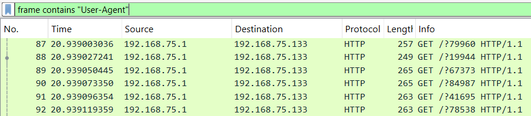

---

## Analysis of TCP stream and header behavior (use filter for only TCP packets – go to follow – TCP stream)

### TCP Stream – Packet 88

Windows sent:  
GET /?19944 HTTP/1.1  
Host: 192.168.75.133  
Accept-Encoding: identity  
User-Agent: Mozilla/5.0 (X11; Linux x86_64)  
Referer: http://www.google.com/?q=5296  
Accept: */*  
Connection: keep-alive

The kali (victim) respond :-  
HTTP/1.1 200 OK  
Content-Length: 10703  
Content-Type: text/html  
Connection: Keep-Alive

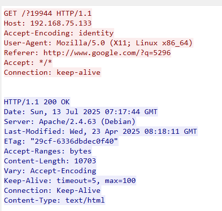

---

### TCP Stream – Packet 114

Windows sent:  
GET /?76640 HTTP/1.1  
Host: 192.168.75.133  
Accept-Encoding: identity  
User-Agent: Mozilla/5.0 (Macintosh; Intel Mac OS X 10_15_7)  
Referer: http://search.yahoo.com/search?p=4672  
Accept: */*  
Connection: keep-alive

The kali (victim) respond :-  
HTTP/1.1 200 OK  
Content-Length: 10703  
Connection: Keep-Alive  
Content-Type: text/html

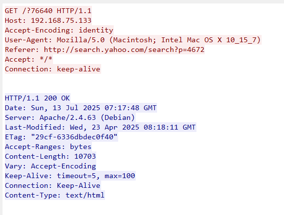

---

### TCP Stream – Packet 391

Windows sent:  
GET /?66099 HTTP/1.1  
Host: 192.168.75.133  
Accept-Encoding: identity  
User-Agent: Mozilla/5.0 (Windows NT 10.0; Win64; x64)  
Referer: http://www.bing.com/search?q=5427  
Accept: */*  
Connection: keep-alive

The kali (victim) respond :-  
HTTP/1.1 200 OK  
Content-Length: 10703  
Content-Type: text/html  
Connection: Keep-Alive

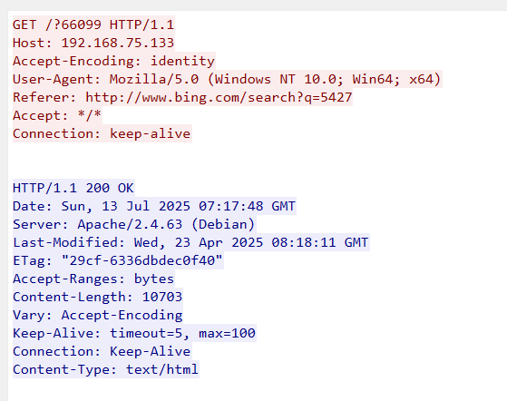

---

To analyse the behaviour of the HULK attack on a per-connection level, multiple GET requests were inspected across TCP streams (e.g., packets 88, 114, and 391), Each inspected TCP stream confirms that the HULK attack uses different GET request with randomized query, A unique Referer header (different domains or search terms) and a varied User-Agent header (spoofed OS/browser combos).

In response the server consistently returns HTTP/1.1 200 OK, Same content served (Content-Length: 10703), No error or 408 Timeout. HULK tries to flood the server with as many full, valid, and random HTTP requests as possible. The server is forced to generate full responses every time, which increases CPU & memory load.

This shows the behaviour of HULK which is aggressive, and pattern is different than slow and half open port to similar types of requests send, in this method due to continues changing the user agent and the referrer its hard to detect for the victim and its WAF and the server have to every time proceeds to responds back thinking as legitimate user and drained the process power of the server and keep engaging it.

---

## Capture File Properties (for the full traffic on Wireshark)

Total packets:- 66641  
Total time span :- 65.616 sec – this is the total duration of the Wireshark captured packets (actual attack performed only 30 sec)  
Average PPs :- 1015.6  
Average packet size :- 989 byte

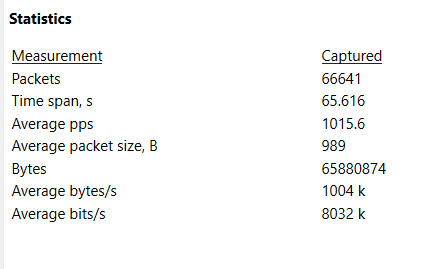

---

## Conversations (statistics – conversations)

The TCP Conversations view showed multiple simultaneous connections from the attacker (192.168.75.1) to Apache (192.168.75.133) on port 80, multiple TCP Conversations Over 6000+ distinct streams, it also shown that continues HTTP response is send by the sever which confirm the drainage of server resources and its engagement.

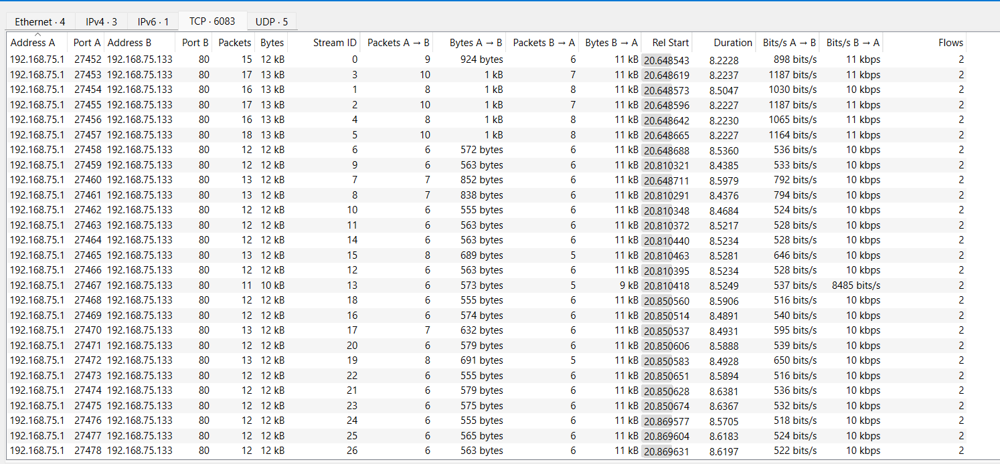

---

## Protocol hierarchy (statistics – protocol hierarchy)

Total Packets: 66,641 (100%)

Protocols Involved:  
IPv4: 100% of the packets  
TCP: 100% of transport-level packets (66,609)  
HTTP: 11,066 packets (16.6%), of which 5,464 are line-based text data (8.2%)

The protocol hierarchy confirms the attack was entirely HTTP-based over TCP with full GET requests. The byte distribution shows nearly all load was HTTP content, validating HULK's behaviour of overloading the server with legitimate but randomized GET requests and payloads.

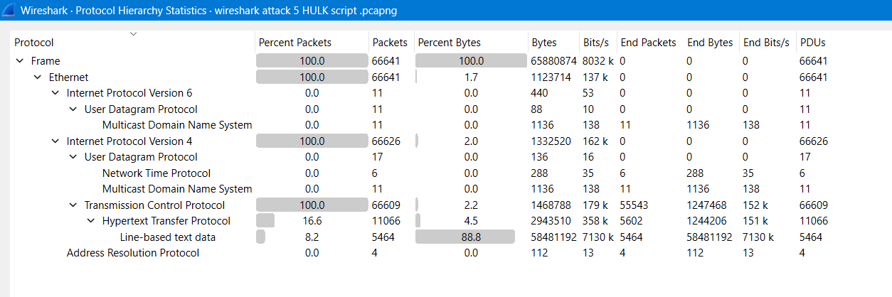

---

## Visual traffic analysis

### I/O graph (statistics – I/O graph)

Filter used :- ip.src == 192.168.75.1  
interval :- 1 sec.

Graph lines:  
All packets (red): Full traffic (attacker + server)  
HULK PPs (black): Filtered attacker packets

There is one initial phase is seen during the 0 to 25 sec. where no packet activity is seen, after that during 27sec. there is a sudden spike seen while the parallel rise in attacker packets and total packets, indicating attacker traffic is dominating the network. At peak, HULK hits over 8,000 packets/sec, which is very high for a single source. During the 40 sec. the graph is gradually dropping and after 55 sec the Traffic almost flat again — this suggests that the attack is over.

The graph confirms the abrupt flood behaviour, proving that the server had to deal with a massive volume of distinct sessions in a short time.

---

## Flow graph (statistics – flow graph, flow type selected as TCP flows)

The TCP Flow Graph reveals a highly aggressive flooding pattern initiated by the attacker (192.168.75.1), where each HTTP GET request is delivered using a new TCP connection with unique source ports. All packets display the PSH, ACK flag, indicating the immediate push of complete HTTP payloads without awaiting server responses. The persistent use of Seq=1 Ack=1 across all packets confirms stateless and non-interactive behaviour, a signature trait of HULK. This high-rate, connection-heavy strategy aims to rapidly consume server resources such as sockets and threads, resulting in performance degradation and potential denial-of-service.

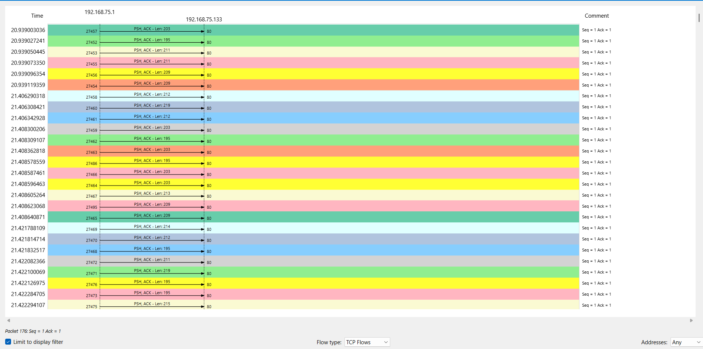

---

## Summary

Wireshark captured a total of 66,641 packets during the HULK attack, but dropped 10,646 packets (16%) during real-time capture due to high incoming rate (~2000+ PPS). While this partial loss may have omitted some TCP control packets or redundant GETs, sufficient traffic was retained to confirm the nature, structure, and behaviour of the HULK flood. The GET requests featured randomized URI paths, User-Agent strings, and Referrer headers — overwhelming Apache’s backend by bypassing caching and evading WAFs. Packet size entropy was high, and the server initially responded with HTTP 200 OK, but later stopped responding entirely, indicating potential saturation. This Layer 7 flood represents a high-speed, dynamic-load denial vector not easily mitigated by traditional defences.
