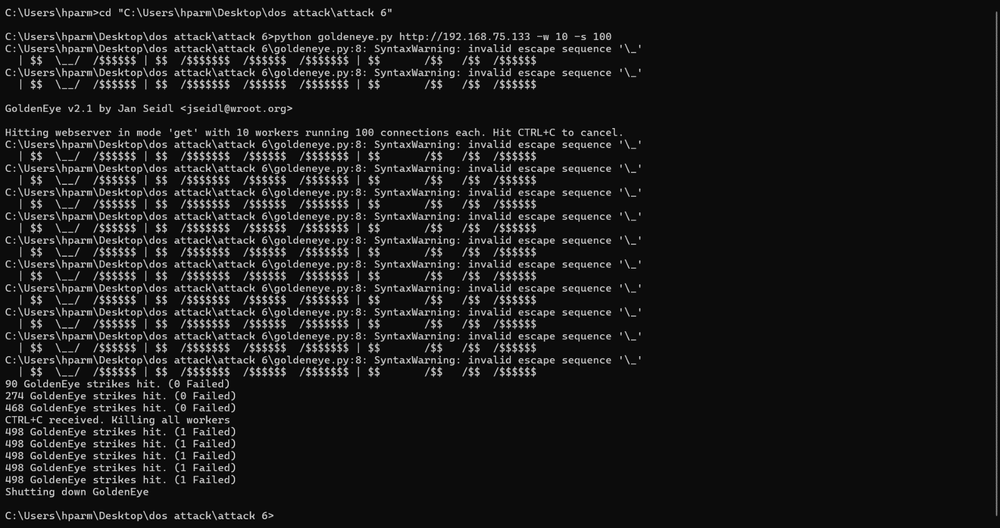
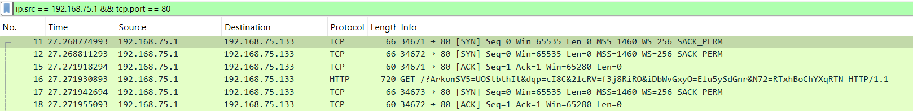
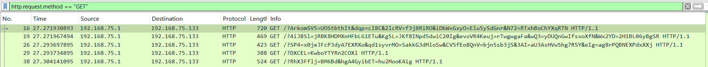
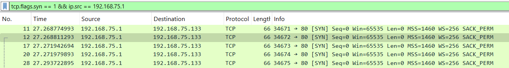
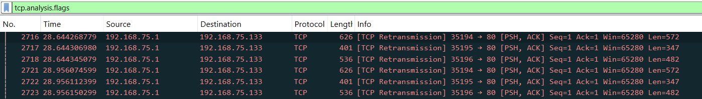
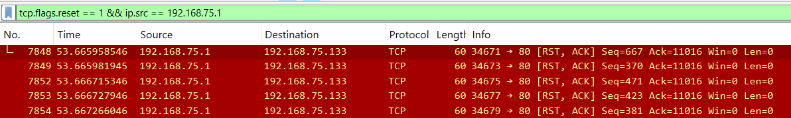
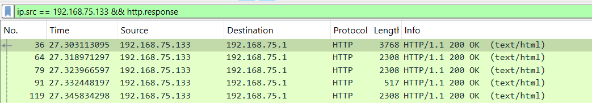
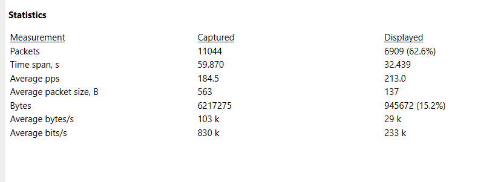
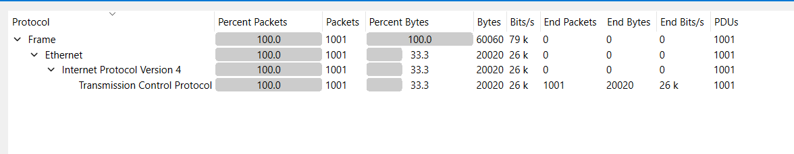
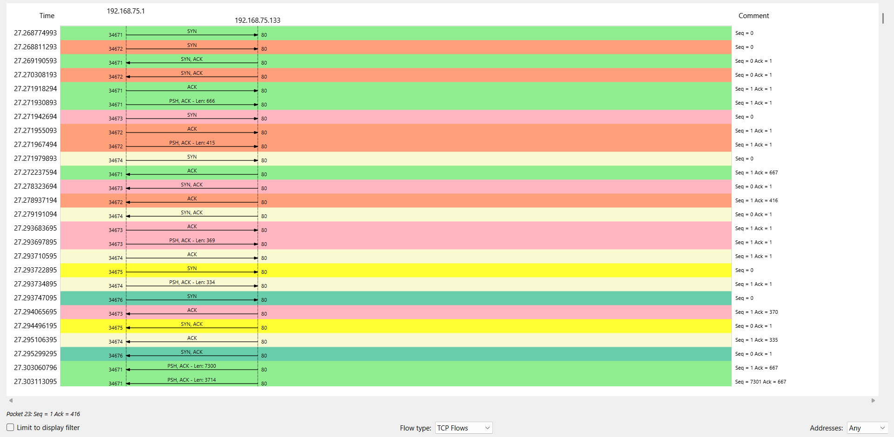

# Attack 6 GoldenEye Analysis

The cmd screenshot also provide some valuable information

## Details

Total packets :- 11144 packets

Layer :- layer 7 attack

Duration :- 30 sec.

The attack is run on loop till the service crash so the attack needs to manually stop by using Ctr + C which interrupted the flow and stop it.

---

  
**Filter 1 :-** `ip.src == 192.168.75.1 && tcp.port == 80` (6909 packets - 62.2%)  
Shows all outgoing traffic from the attacker to the server on HTTP port 80 (includes GETs, handshakes, RSTs, ACKs).

---

  
**Filter 2 :-** `http.request.method == "GET"` (1055 packets – 9.4%)  
Filters only HTTP GET requests, showing actual Goldeneye application-layer floods.

---

  
**Filter 3 :-** `tcp.flags.syn == 1 && ip.src == 192.168.75.1` (1228 packets – 11.1%)  
Captures all TCP connection attempts initiated by attacker (SYN packets).

---

  
**Filter 4 :-** `tcp.analysis.flags` (393 packets - 3.6%)  
Highlights TCP anomalies like retransmissions, delays, or out-of-order segments — indicates network pressure or instability.

---

  
**Filter 5 :-** `tcp.flags.reset == 1 && ip.src == 192.168.75.1` (1001 packets – 9.1%)  
Shows all RST packets sent by attacker — confirming forceful disconnection after GETs.

---

**Filter 6 :-** `tcp.flags.reset == 1 && ip.src == 192.168.75.133` (0 packets)  
Detects any resets sent by the server, which would imply socket exhaustion or defensive rejection (0 in this case = no active rejection).

---

  
**Filter 7 :-** `ip.src == 192.168.75.133 && http.response` (583 packets – 5.3%)  
This filter out the all HTTP responses from the server, including status codes like 200 OK, 503, etc.  
_All 200 OK packets_

---

## Capture File Properties

Packets: total packets Wireshark has captured is 11044 and displayed means filtered attacked packets are 6909 packets.  
Time span, second: the total 59.870 sec which is the total time Wireshark traffic has captured, and the actual attack timings are 32.439 sec  
Average PPs: through to the full traffic capture is 184.5 and for the filtered only attacked is 213  
Average packets size: for the full traffic captured is 563 byte and for the filtered one is 137 which is actually lower due to it’s not that much bigger packets  

---

## Protocol hierarchy

---

## Flow graph (statistics – flow graph, flow type selected as TCP flows)

---

## Summary
From total packets captured on Wireshark is 1144 where, The Goldeneye DoS attack generated 1,055 unique HTTP GET requests over 1,228 TCP connections, captured within a 30-second burst. Each request carried modest header variation and was sent through aggressively opened and forcefully closed sockets — with 1,001 RST packets confirming rapid connection drops. The Apache server initially handled requests, returning 583 HTTP 200 OK responses, but showed signs of saturation as the attack progressed.
