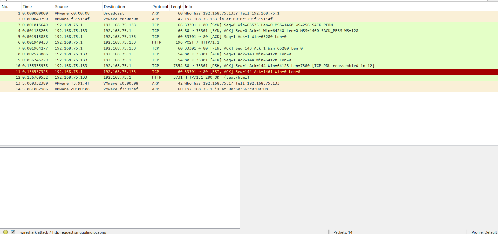
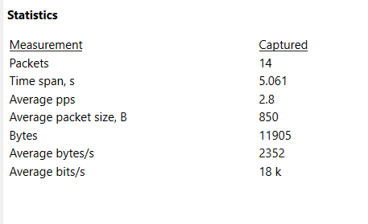
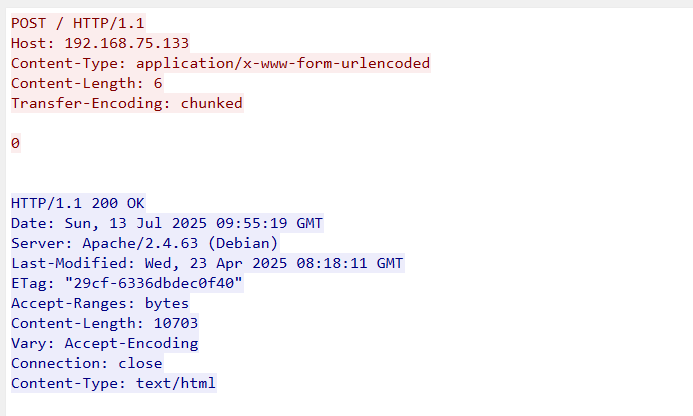
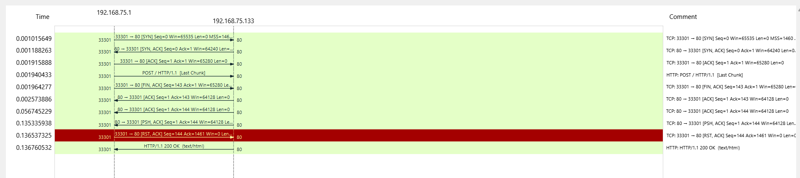

# Attack 7 HTTP Request Smuggling analysis

## The Wireshark traffic analysis

Total packets: 14 packets

Layer: Application Layer (Layer 7)

Duration:  3 second

### All packets analysis

Packet 1 & 2 :- this both are the ARP protocol based normal packets.

Packet 3, 4,5 :- this 3 are the TCP protocol based the 3 ways handshake packets with the SYN, SYN ACK, ACK so they are normal connection establishment conversation packets.

Packet 6 :-  POST / HTTP/1.1 – this is my malicious payload request which is HTTP protocol based, POST request with dual headers, the length is 196 bytes.

Packet 7:- ACK from server, which means the server has aacknowledged the received data (it transfers the large chunk of data).

Packet 8:- FIN-ACK from client, which indicate the client closes the connection.

Packet 9 :- ACK from server, which means the server has acknowledge the closes of the connection.

packet 10 :- New GET request, it can be Smuggled second request or frontend retry. (transfer large chunks of data)

Packet 11 :- Server reset the TCP connection after parsing the request This implies that the server was confused by the smuggled structure.

Packet 12 :-  get a valid response even after the RST, which confirming that Server completed the request, despite protocol confusion, it still processed smuggled content.

Packet 13 and 14 :- this both are the ARP protocol based normal background traffic packets.

## The full capture file properties

Time span in sec – 5.061 sec

Average PPS – 2.8

Average packet size – 850 bytes

Average bytes/s – 2352

## Analysis of TCP stream

TCP Stream – Packet 6

Attacker send (windows) -  

POST / HTTP/1.1

Host: 192.168.75.133

Content-Type: application/x-www-form-urlencoded

Content-Length: 6

Transfer-Encoding: chunked

0

Kali victim respond -

HTTP/1.1 200 OK

Server: Apache/2.4.63 (Debian)

ETag: "29cf-6336dbdec0f40"

Content-Length: 10703

Connection: close

Content-Type: text/html

So here the POST/HTTP/1.1 is the POST request initiation , the content length – 6 and the transfer-encoding : chunked is the main spot where the 6 length telling that body should have 6 bytes( which is used by the front-end) and the chunked transfer encoding again saying the same thing about the length of the body( which is used by the backend) so here we are having the conflict due to this.

And the POST request ending with 0 is helping to add another smuggling of the packet after this.server processed the request successfully, despite the malformed format — a signature of successful or attempted smuggling.

## Flow graph (statistics – flow graph)

## Behaviour & Analysis

We can clearly see that packet 11 is the RST packet still the server sends the 200Ok response in the 12th packet. So, this show that the smuggled content is processed with server completing the request.

Due to the minimal number of packets (only 14 captured), a full filtering strategy was not necessary. All packets were manually inspected, and the attack signature (conflicting `Transfer-Encoding` and `Content-Length` headers used in the smuggling technique) was clearly observable.

There is dual way to inform the server in the packet 6 and the POST request in that ends with a 0 which is a big key of analysis, here the 0 indicate the end here and helps in smuggling another packet after this and we can clearly see that packet 10 is the New get request and its transfer large chunks of data with it.

Within the packets 11 and 12 we can see that Packet 11: TCP Reset suggests frontend detected something was wrong but still the Packet 12: Despite the reset, the backend still processes a full GET request and returns a 200 OK page. It is a clear indication of desynchronization: - One server (likely the frontend or reverse proxy) aborted the connection while the backend continued processing the payload. This is the textbook behaviour of a successful HTTP Request Smuggling attack.

## Summary

The HTTP Request Smuggling attack was carried out using a custom Python script that sent a crafted POST request containing both Content-Length and Transfer-Encoding: chunked headers to exploit parsing discrepancies between web servers. The Wireshark capture included only 14 packets, making it a low-volume but precise attack. Packet 6 revealed the smuggling attempt, with a suspiciously small payload (0\r\n\r\n) designed to confuse the server’s request boundary handling. The server responded with an HTTP 200 OK, indicating that the malformed request was processed without errors. TCP stream analysis confirmed the smuggled structure and validated the success of the attack. Despite low packet volume, the attack demonstrates a clear application-layer desynchronization attempt.
